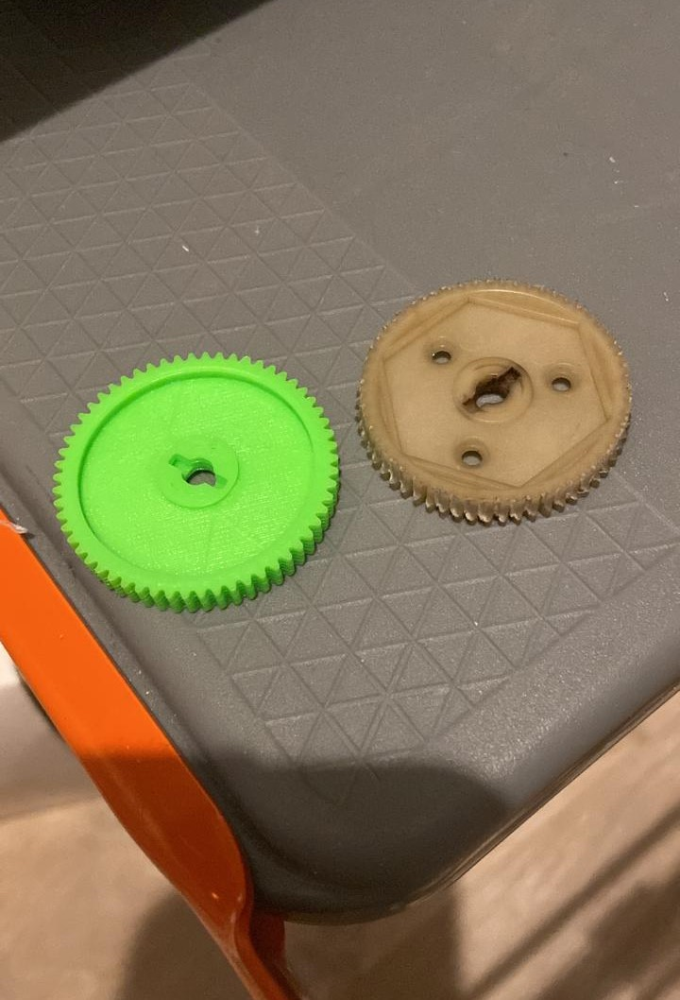

# 3D Printer Projects

This section showcases my experience with 3D printers, including assembly, setup, calibration, and maintenance. My hands-on experience spans various types of FDM (Fused Deposition Modeling) 3D printers.

## Experience Overview

### **1. 3D Printer Assembly & Setup**
- **Various Models**: Assembled and configured a wide range of FDM 3D printers, including popular models such as Creality Ender series, Prusa i3 MK3, Bambulab X1, and others.
- **Component Integration**: Ensured correct installation and alignment of mechanical, electronic, and extruder components to achieve optimal performance.

### **2. Software Programming & Firmware Configuration**
- **Klipper Firmware**: Programmed and integrated Klipper firmware to enhance the functionality and performance of 3D printers. Ensured seamless communication between the firmware and hardware components for improved print quality and efficiency.
- **Custom Configuration**: Tailored firmware settings to specific printer models and use cases, optimizing parameters such as stepper motor calibration, temperature control, and print speed.

### **3. Calibration & Maintenance**
- **Precision Calibration**: Performed detailed calibration procedures, including bed leveling, extruder calibration, and fine-tuning of print settings to ensure high-quality and accurate prints.
- **Routine Maintenance**: Conducted regular maintenance tasks, such as nozzle cleaning, belt tension adjustments, and firmware updates, to maintain printer performance and longevity.

### **4. Troubleshooting & ETL Inspection**
- **Issue Resolution**: Diagnosed and resolved a variety of issues, including print quality problems, mechanical malfunctions, and firmware bugs. Applied problem-solving techniques to ensure smooth operation and minimize downtime.
- **ETL Inspection**: Conducted Electrical, Thermal, and Load (ETL) inspections to ensure the safety and reliability of 3D printers. Verified that all components met industry standards and operated within specified tolerances.

## Projects & Highlights

- **Creality Ender 3 Modifications**: Customized and upgraded a Creality Ender 3 with additional components and firmware tweaks to enhance print quality and expand its capabilities.
- **Prusa i3 MK3 Tuning**: Optimized the performance of a Prusa i3 MK3 through precise calibration and software adjustments, resulting in improved print accuracy and speed.
- **Kodak Portrait 3D Printer Integration**: Successfully integrated Klipper firmware with the Kodak Portrait 3D Printer, addressing firmware-related issues and achieving stable and reliable 3D printing.

## Visuals

**3D Printer Setup:**

 

**Printed Gears:**

 

---

These projects demonstrate my capability to handle complex 3D printing systems, combining hands-on hardware skills with advanced software configuration. My experience with various 3D printers highlights my ability to work across different technologies and deliver high-quality results.
