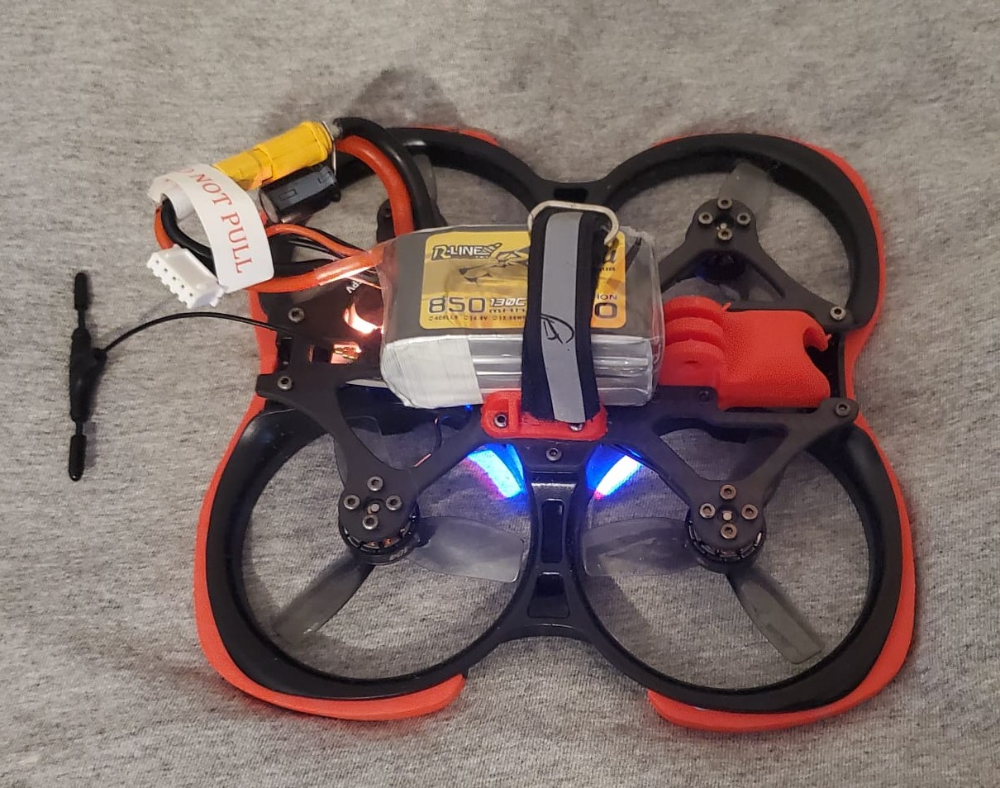

# Drone Projects

This section highlights my experience with drone assembly and integration. I’ve worked with various drone components, focusing on both hardware assembly and software configuration. Below is a showcase of a completed drone build, along with details on the components used and the software configured.

## Experience Overview

### **1. Drone Assembly & Configuration**
- **Complete Drone Build**: Assembled a custom drone using high-quality components to ensure optimal performance and reliability.
- **Component Integration**: Installed and configured key components, including motors, ESCs (Electronic Speed Controllers), propellers, and flight controllers.

### **2. Firmware & Software**
- **Betaflight Configuration**: Programmed and configured Betaflight flight control software to manage the drone’s flight dynamics, including PID tuning, flight modes, and other advanced settings for stable and responsive flight.

### **3. Soldering & Wiring**
- **ESC Soldering**: Performed soldering of ESCs onto the drone's frame, ensuring secure and reliable electrical connections for motor control and power distribution.

## Components Used

- **BetaFpv Pavo25**: A compact and powerful drone frame designed for agility and durability.
- **HQProp Duct-T63MMX3 3-Blade Propeller - Light Grey**: High-performance propellers that offer excellent thrust and efficiency.
- **Tattu R-Line Version 4.0 850mAh 14.8V 130C 4S1P Lipo Battery Pack**: High-capacity battery providing extended flight time and powerful performance.
- **Foxeer ELRS 2.4G Receiver LNA V3.2.0**: Reliable receiver for low-latency communication and control.
- **NeutronRC AT32F435 Mini AIO 32bit AM32 35A ESC ATBETAFLIGHT V1.2**: Advanced 32-bit ESC with integrated Betaflight support for precise motor control.
- **T-Motor F1404 Motor**: High-efficiency motor providing robust thrust and reliability.

## **Complete Drone**
 
This photo shows the fully assembled drone, ready for flight.

---

These projects demonstrate my ability to build and configure high-performance drones, combining meticulous hardware assembly with precise software tuning. My experience with Betaflight and various drone components highlights my capability to deliver advanced and reliable aerial solutions.
